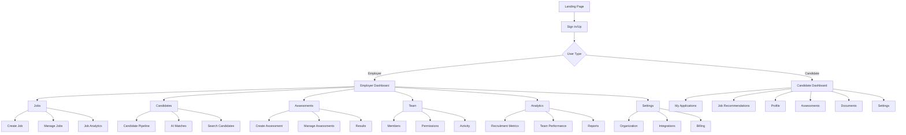
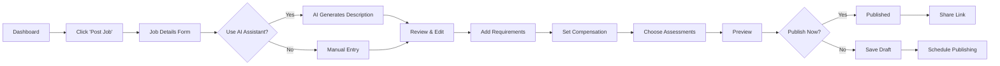
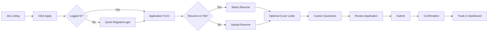
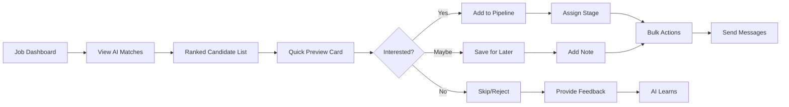

# Agentic Powered Recruitment Platform UI/UX Specification

## Introduction

This document defines the user experience goals, information architecture, user flows, and visual design specifications for the Agentic Powered Recruitment Platform's user interface. It serves as the foundation for visual design and frontend development, ensuring a cohesive and user-centered experience.

### Overall UX Goals & Principles

#### Target User Personas

**1. Emma - The Efficient Recruiter**
- Mid-level talent acquisition specialist at a 200-person tech company
- Manages 10-15 open positions simultaneously
- Values speed and accuracy in candidate matching
- Frustrated by manual resume screening and fragmented tools
- Needs: Streamlined workflows, AI assistance, bulk operations

**2. David - The Hiring Manager**
- Engineering lead with limited time for recruiting (5% of role)
- Reviews 5-10 candidates per position
- Wants qualified candidates without recruitment complexity
- Frustrated by poor candidate quality and lengthy processes
- Needs: Simple interface, clear candidate insights, quick decisions

**3. Sarah - The Job Seeker**
- Mid-career professional actively job searching
- Applies to 20-30 positions monthly
- Values transparency and communication
- Frustrated by application black holes and generic processes
- Needs: Application tracking, personalized recommendations, clear status updates

**4. Michael - The HR Administrator**
- HR director overseeing recruitment operations
- Manages team of 5 recruiters
- Focuses on metrics, compliance, and process optimization
- Frustrated by lack of visibility and manual reporting
- Needs: Analytics dashboard, team management, audit trails

#### Usability Goals

- **Ease of Learning:** New users complete first job posting or application within 10 minutes
- **Efficiency of Use:** Power users can review 20 candidates in under 5 minutes using keyboard shortcuts
- **Error Prevention:** Smart validation and confirmation dialogs for all destructive actions
- **Memorability:** Returning users can navigate without relearning after 30-day absence
- **Satisfaction:** Achieve 4.5+ star user satisfaction rating through delightful interactions

#### Design Principles

1. **AI as Co-pilot, Not Autopilot** - AI enhances human decision-making without removing control
2. **Progressive Disclosure** - Show simple options first, reveal complexity as needed
3. **Speed Through Intelligence** - Reduce clicks through smart defaults and predictions
4. **Transparency Builds Trust** - Always explain AI decisions and system status
5. **Accessible by Design** - WCAG AA compliance from day one, not as afterthought

### Change Log

| Date | Version | Description | Author |
|------|---------|-------------|---------|
| 2025-01-30 | 1.0 | Initial UI/UX specification | Sally (UX Expert) |

## Information Architecture (IA)

### Site Map / Screen Inventory

### Navigation Structure

**Primary Navigation:** Persistent left sidebar with icon + label navigation for main sections (Dashboard, Jobs, Candidates, Assessments, Team, Analytics, Settings). Collapsible to icon-only mode for more screen space.

**Secondary Navigation:** Horizontal tabs within each primary section for subsections. Breadcrumb trail shows current location and enables quick navigation up the hierarchy.

**Command Palette:** Global Cmd+K search for quick navigation to any screen, job, or candidate. AI-powered suggestions based on recent activity and common tasks.

## User Flows

### Employer: Post a New Job

**User Goal:** Create and publish a job posting to attract qualified candidates

**Entry Points:** Dashboard quick action, Jobs section, or command palette

**Success Criteria:** Job posted and receiving applications within 5 minutes

#### Flow Diagram

#### Edge Cases & Error Handling:
- Duplicate job title warning with option to proceed
- Auto-save every 30 seconds prevents data loss
- Validation errors shown inline without losing progress
- Network failure queues job for retry with notification

**Notes:** AI assistance available at each step but never required. Smart defaults based on previous jobs and industry standards.

### Candidate: Apply for a Job

**User Goal:** Successfully apply for a relevant job opportunity

**Entry Points:** Job board, email link, or recommendations dashboard

**Success Criteria:** Application submitted with confirmation within 3 minutes

#### Flow Diagram

#### Edge Cases & Error Handling:
- Resume parsing errors show manual entry option
- Timeout protection saves progress for 24 hours
- Duplicate application prevention with clear messaging
- File size/format validation with helpful error messages

**Notes:** One-click apply for returning users with saved profiles. LinkedIn import option available for faster profile creation.

### Recruiter: Review AI Matches

**User Goal:** Efficiently review AI-recommended candidates and take action

**Entry Points:** Job dashboard, email notification, or AI matches section

**Success Criteria:** Review 20 candidates and shortlist 5 in under 10 minutes

#### Flow Diagram

#### Edge Cases & Error Handling:
- No matches found triggers alternative search suggestions
- Conflicting team decisions highlighted for resolution
- Bulk operation limits (max 50) with queuing for larger sets
- Undo option for accidental rejections (30-second window)

**Notes:** Keyboard shortcuts enable rapid review (J/K to navigate, Y/N for yes/no, S to save). AI explanations available on hover but not intrusive.

## Wireframes & Mockups

**Primary Design Files:** [Figma - WeAssist Recruitment Platform](https://figma.com/file/xxxxx)

### Key Screen Layouts

#### Dashboard (Employer)
**Purpose:** Provide at-a-glance overview and quick access to priority actions

**Key Elements:**
- Metrics cards (Time to Hire, Open Positions, Candidates in Pipeline, Upcoming Interviews)
- AI Insights panel with actionable recommendations
- Recent activity feed with real-time updates
- Quick actions toolbar (Post Job, Search Candidates, Schedule Interview)
- Pipeline overview widget showing candidate distribution

**Interaction Notes:** Drag-and-drop widgets for personalization. Real-time updates without page refresh. Click any metric for detailed view.

**Design File Reference:** Figma Frame: Dashboard-Employer-Default

#### Candidate Pipeline (Kanban View)
**Purpose:** Visual pipeline management with drag-and-drop functionality

**Key Elements:**
- Customizable pipeline stages as columns
- Candidate cards with photo, name, match score, and key skills
- Stage action buttons (bulk email, advance all, archive)
- Filters bar (skills, experience, assessment scores)
- Team presence indicators showing who's viewing

**Interaction Notes:** Smooth drag animations with drop zone highlights. Multi-select with Shift+Click. Right-click context menus for quick actions.

**Design File Reference:** Figma Frame: Pipeline-Kanban-View

#### AI Matching Results
**Purpose:** Present AI-recommended candidates with transparency and actionability

**Key Elements:**
- Match score with explanation tooltip
- Side-by-side comparison view option
- Quick action buttons (thumbs up/down, save, message)
- Expandable preview with key highlights
- Batch operation toolbar

**Interaction Notes:** Hover reveals why AI made the match. Keyboard navigation for power users. Instant feedback updates AI model.

**Design File Reference:** Figma Frame: AI-Matches-List

## Component Library / Design System

**Design System Approach:** Leveraging shadcn/ui as the foundation with custom theme and extended components for recruitment-specific needs. This ensures consistency with modern React patterns while maintaining flexibility.

### Core Components

#### Card Component
**Purpose:** Primary container for content across the platform

**Variants:** Default, Elevated, Interactive, Compact

**States:** Default, Hover, Active, Selected, Disabled, Loading

**Usage Guidelines:** Use elevated variant for primary actions. Interactive variant for clickable items. Always include 16px padding minimum.

#### Button Component
**Purpose:** Trigger actions throughout the interface

**Variants:** Primary, Secondary, Ghost, Destructive, AI-Powered (purple gradient)

**States:** Default, Hover, Active, Loading, Disabled

**Usage Guidelines:** Primary for main CTA per screen. AI-Powered for AI-assisted actions. Destructive requires confirmation.

#### Form Input Component
**Purpose:** Collect user input across forms

**Variants:** Text, Textarea, Select, Multi-select, Date picker, File upload

**States:** Default, Focus, Error, Success, Disabled, Loading

**Usage Guidelines:** Always include labels. Show validation on blur. Provide helpful placeholder text. Support autofill.

#### Pipeline Card Component
**Purpose:** Represent candidates in pipeline views

**Variants:** Compact, Standard, Expanded

**States:** Default, Hover, Dragging, Selected, Archived

**Usage Guidelines:** Show match score prominently. Include quick actions on hover. Support batch selection.

#### Data Table Component
**Purpose:** Display structured data with sorting and filtering

**Variants:** Basic, Sortable, Selectable, Expandable

**States:** Default, Loading, Empty, Error

**Usage Guidelines:** Sticky headers for long lists. Responsive design collapses to cards on mobile. Virtual scrolling for performance.

## Branding & Style Guide

### Visual Identity
**Brand Guidelines:** Modern, professional, and approachable with AI-forward purple accents

### Color Palette

The theme uses HSL color values with CSS custom properties for dynamic theming support. Colors adapt automatically between light and dark modes.

| Color Type | Light Mode | Dark Mode | CSS Variable | Usage |
|------------|------------|-----------|--------------|--------|
| Background | hsl(216 33% 97%) | hsl(230 20% 12%) | --background | Main background |
| Foreground | hsl(224 37% 16%) | hsl(222 35% 93%) | --foreground | Primary text |
| Primary | hsl(213 106% 67%) | hsl(217 91% 60%) | --primary | Primary actions, CTAs |
| Primary Foreground | hsl(216 33% 97%) | hsl(230 20% 12%) | --primary-foreground | Text on primary |
| Secondary | hsl(175 84% 32%) | hsl(173 80% 40%) | --secondary | Secondary actions, AI features |
| Secondary Foreground | hsl(216 33% 97%) | hsl(230 20% 12%) | --secondary-foreground | Text on secondary |
| Accent | hsl(203 49% 64%) | hsl(217 71% 86%) | --accent | Highlights, selected states |
| Muted | hsl(60 10% 89%) | hsl(237 25% 18%) | --muted | Disabled states, backgrounds |
| Muted Foreground | hsl(221 84% 53%) | hsl(218 17% 55%) | --muted-foreground | Secondary text |
| Destructive | hsl(291 23% 18%) | hsl(336 39% 51%) | --destructive | Delete, error actions |
| Border | hsl(224 37% 16%) | hsl(222 35% 93%) | --border | Borders, dividers |
| Card | hsl(212 37% 92%) | hsl(237 25% 18%) | --card | Card backgrounds |

### Shadow System

The design system features a unique neomorphic shadow style with solid offset shadows:

| Shadow Level | CSS Variable | Light Mode Value | Usage |
|--------------|--------------|------------------|--------|
| 2xs | --shadow-2xs | 2px 2px 0px 0px hsl(224 37% 16% / 0.5) | Subtle depth |
| xs | --shadow-xs | 2px 2px 0px 0px hsl(224 37% 16% / 0.5) | Small elements |
| sm | --shadow-sm | 2px 2px + blur | Buttons, inputs |
| Default | --shadow | 2px 2px + blur | Cards, dropdowns |
| md | --shadow-md | 2px 2px + 4px blur | Hover states |
| lg | --shadow-lg | 2px 2px + 6px blur | Modals, popovers |
| xl | --shadow-xl | 2px 2px + 10px blur | Large overlays |

### Typography

#### Font Families
- **Primary:** Inter (system fallback: -apple-system, BlinkMacSystemFont, Segoe UI)
- **Secondary:** Inter (same as primary for consistency)
- **Monospace:** JetBrains Mono (fallback: Consolas, Monaco, monospace)

#### Type Scale

| Element | Size | Weight | Line Height |
|---------|------|--------|-------------|
| H1 | 36px | 700 | 1.2 |
| H2 | 30px | 600 | 1.3 |
| H3 | 24px | 600 | 1.4 |
| Body | 16px | 400 | 1.6 |
| Small | 14px | 400 | 1.5 |

### Iconography
**Icon Library:** Lucide React (consistent with shadcn/ui)

**Usage Guidelines:** 20px for navigation, 16px for inline, 24px for empty states. Always include aria-labels for accessibility.

### Spacing & Layout
**Grid System:** 12-column grid with responsive gutters

**Spacing Scale:** Based on --spacing custom property (0.25rem = 4px base)
- xs: 0.25rem (4px)
- sm: 0.5rem (8px)
- md: 1rem (16px)
- lg: 1.5rem (24px)
- xl: 2rem (32px)
- 2xl: 3rem (48px)
- 3xl: 4rem (64px)

**Border Radius:** --radius: 0.25rem (4px) for consistent rounded corners

## Accessibility Requirements

### Compliance Target
**Standard:** WCAG 2.1 Level AA

### Key Requirements

**Visual:**
- Color contrast ratios: 4.5:1 for normal text, 3:1 for large text
- Focus indicators: 2px solid outline with 2px offset
- Text sizing: Supports 200% zoom without horizontal scroll

**Interaction:**
- Keyboard navigation: All interactive elements accessible via keyboard
- Screen reader support: ARIA labels and live regions for dynamic content
- Touch targets: Minimum 44x44px for mobile interfaces

**Content:**
- Alternative text: Descriptive alt text for all informative images
- Heading structure: Logical h1-h6 hierarchy
- Form labels: Associated labels for all form inputs

### Testing Strategy
Automated testing with axe-core, manual testing with NVDA/JAWS, real user testing with users who have disabilities

## Responsiveness Strategy

### Breakpoints

| Breakpoint | Min Width | Max Width | Target Devices |
|------------|-----------|-----------|----------------|
| Mobile | 320px | 639px | Phones |
| Tablet | 640px | 1023px | Tablets, small laptops |
| Desktop | 1024px | 1535px | Laptops, desktops |
| Wide | 1536px | - | Large monitors |

### Adaptation Patterns

**Layout Changes:** Sidebar becomes bottom navigation on mobile. Multi-column layouts stack vertically. Modals become full-screen sheets.

**Navigation Changes:** Hamburger menu on mobile. Tab navigation becomes dropdown. Breadcrumbs hidden on mobile.

**Content Priority:** Hide secondary information on mobile. Progressive disclosure through expandable sections. Critical actions always visible.

**Interaction Changes:** Swipe gestures for mobile navigation. Long press for context menus. Pull-to-refresh for content updates.

## Animation & Micro-interactions

### Motion Principles
Fast and subtle animations that provide feedback without slowing users down. Follow material design timing curves. Respect prefers-reduced-motion settings.

### Key Animations
- **Page Transitions:** Fade with subtle slide (200ms, ease-out)
- **Card Hover:** Subtle elevation change (150ms, ease-in-out)
- **Loading States:** Skeleton screens with shimmer (infinite, linear)
- **Drag and Drop:** Smooth follow with ghost element (instant, linear)
- **Success Feedback:** Checkmark draw animation (400ms, ease-out)
- **AI Processing:** Purple gradient pulse (2s, ease-in-out)

## Performance Considerations

### Performance Goals
- **Page Load:** < 2 seconds on 3G connection
- **Interaction Response:** < 100ms for user input
- **Animation FPS:** Consistent 60fps for all animations

### Design Strategies
Lazy load images below the fold. Virtual scrolling for long lists. Optimistic UI updates with rollback on error. Progressive enhancement for complex features. CDN delivery for all static assets.

## Next Steps

### Immediate Actions
1. Create high-fidelity mockups in Figma for all primary screens
2. Develop interactive prototype for user testing
3. Conduct usability testing with 5 users per persona
4. Create component documentation in Storybook
5. Set up design tokens for developer handoff

### Design Handoff Checklist
- [x] All user flows documented
- [x] Component inventory complete
- [x] Accessibility requirements defined
- [x] Responsive strategy clear
- [x] Brand guidelines incorporated
- [x] Performance goals established

## Checklist Results
Design specification complete and ready for implementation with shadcn/ui components and Tailwind CSS styling.